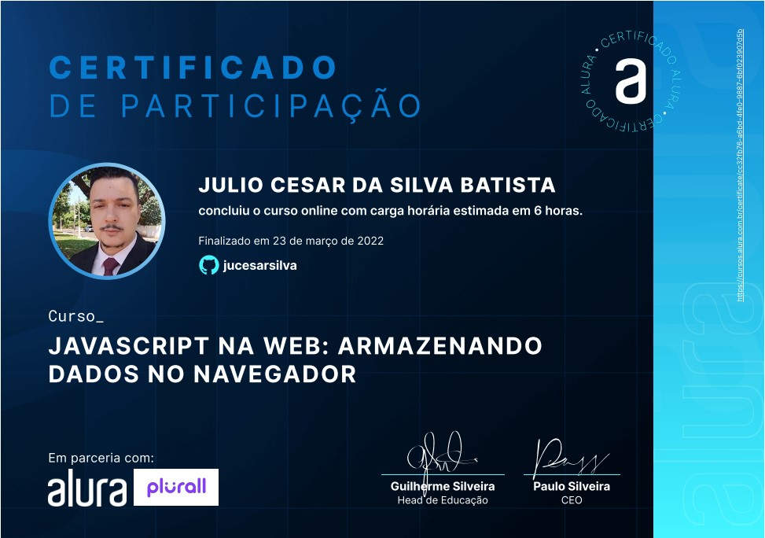
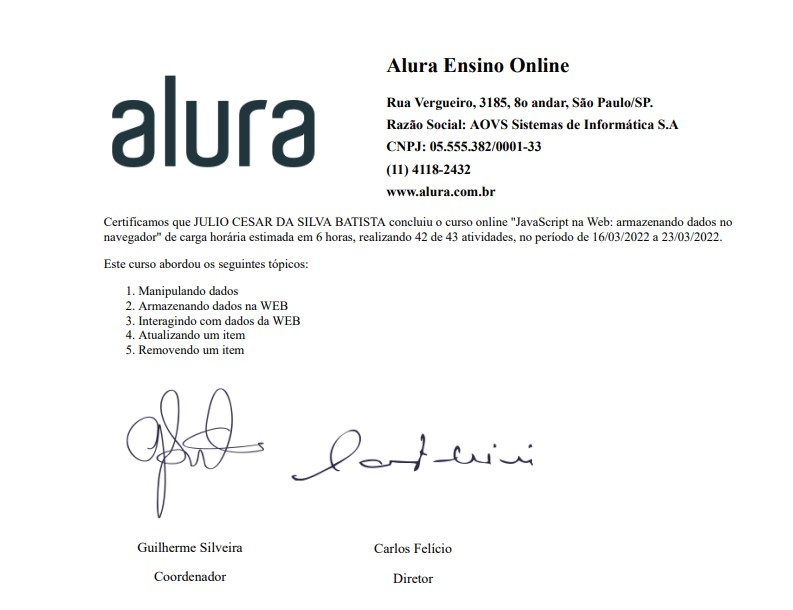
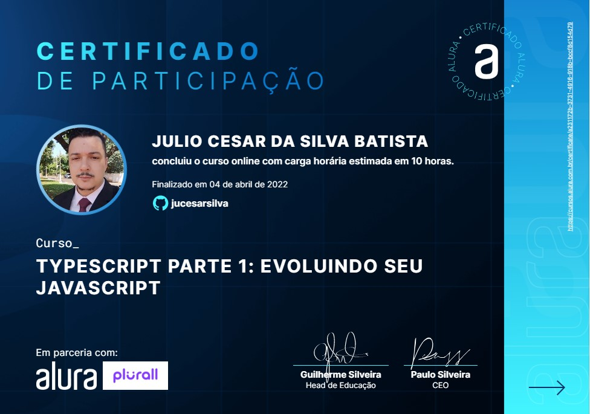
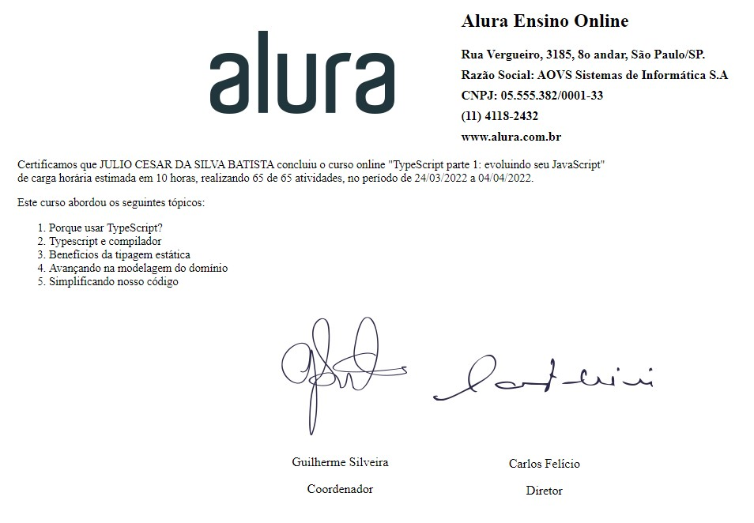

# Projeto de estudo

Este projeto centraliza os exercícios dos cursos realizados na Alura

 

## Curso: javascript na web armazenando dados no navegador
[DEMO](https://jucesarsilva.github.io/alura/mochila-de-viagem/)
 
 
 

 
 

## Curso: TYPESCRIPT PARTE 1: EVOLUINDO SEU JAVASCRIPT
[DEMO](https://jucesarsilva.github.io/alura/typescript-curso-1/public/)
 
 
 

 
 
